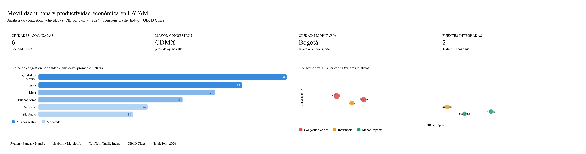

# 🚦 Movilidad Urbana y Productividad Económica en LATAM (2024)

> **Proyecto de Análisis de Datos · TripleTen · 2026**  
> Herramientas: Python · Pandas · NumPy · Seaborn · Matplotlib

---

## 📌 Contexto del Proyecto

Las ciudades latinoamericanas enfrentan un desafío doble: alta congestión vehicular y brechas en productividad económica. Pero, ¿existe una relación real entre ambos fenómenos?

Este proyecto busca responder esa pregunta a través del análisis de datos reales:

**¿Qué relación existe entre la movilidad urbana (congestión y tiempos de viaje) y la productividad económica (PIB per cápita) en las principales ciudades de América Latina durante 2024?**

### Fuentes de datos
| Dataset | Fuente | Variables clave |
|---|---|---|
| Índices de tráfico urbano | TomTom Traffic Index | `jams_delay`, `traffic_index_live`, `mins_delay`, `jams_count` |
| Indicadores económicos por ciudad | OECD Cities | `city_gdp_capita`, `unemployment_pct`, `population` |

Las ciudades analizadas incluyen **Bogotá, Lima, Buenos Aires, Santiago y Ciudad de México**, entre otras.

---

## 🔬 Análisis

### 1. Carga y exploración de datos
Se importaron dos datasets (`tomtom_traffic.csv` y `oecd_city_economy.csv`) y se realizó una inspección inicial para entender estructura, tipos de datos y posibles inconsistencias.

### 2. Limpieza y preparación
Se aplicaron las siguientes transformaciones:
- **Estandarización de columnas** a formato `snake_case` en ambos datasets.
- **Conversión de fechas** (`update_time_utc`) de texto a tipo `datetime` con `pd.to_datetime()`.
- **Corrección de formatos numéricos** en variables económicas: eliminación de separadores de miles (`.`), símbolos de porcentaje (`%`) y ajuste de separadores decimales (`,` → `.`).
- **Creación de columna `population`** multiplicando `population_m × 1.000.000` para trabajar con valores absolutos.

### 3. Filtrado y agregación
- Se extrajo el año de la columna de fecha y se filtraron únicamente los registros de **2024**.
- Los datos de tráfico (con múltiples registros diarios por ciudad) se consolidaron calculando **promedios anuales por ciudad**, obteniendo una vista limpia y representativa.

### 4. Integración de datasets
Se realizó una unión de tipo **INNER JOIN** entre los datasets de tráfico y economía usando `city` y `year` como claves, garantizando que el análisis final incluyera solo ciudades presentes en ambas fuentes.

### 5. Visualización
Se generaron tres tipos de gráficos para explorar patrones:
- **Boxplot** de `jams_delay` → para detectar valores atípicos y distribución de la congestión.
- **Histograma** de `city_gdp_capita` → para analizar la distribución del PIB per cápita entre ciudades.
- **Gráfico de barras comparativo** entre `jams_delay` y `city_gdp_capita` por ciudad → para identificar visualmente la relación entre movilidad y economía.

---

## 📊 Conclusiones Principales

### 🏙️ Ciudad de México lidera la congestión
Al ordenar los datos por `jams_delay`, Ciudad de México encabeza los niveles de congestión vehicular en toda la región, con los valores más altos de demora por embotellamientos.

### 📈 La relación entre PIB y congestión no es lineal
Las ciudades con mayor actividad económica tienden a concentrar más tráfico, ya que una economía más activa demanda mayor movilidad de personas y bienes. Sin embargo, aquellas con mayor inversión en infraestructura logran mitigar parcialmente ese efecto, lo que rompe la relación directa entre PIB alto y congestión alta.

### 🎯 Bogotá como ciudad prioritaria para inversión
De las ciudades analizadas, **Bogotá emerge como la ciudad con mayor necesidad de inversión en infraestructura de transporte**, al combinar altos niveles de congestión con un PIB per cápita relativamente bajo frente a su densidad poblacional — una brecha significativa entre demanda de movilidad y capacidad de respuesta del sistema vial.

### ⚠️ Valores atípicos detectados
Se identificaron valores extremos en `jams_delay` que podrían corresponder a eventos específicos o errores de medición. Estos registros requieren validación adicional antes de ser utilizados en modelos predictivos.
---
## 📁 Estructura del Repositorio

```
📦 mobility-economy-latam
 ┣ 📓 S5_ladb_mobility_economy_project_student.ipynb  ← Notebook principal
 ┣ 📄 ladb_mobility_economy_2024_clean.csv            ← Dataset final limpio
 ┗ 📄 README.md
```

---

## 👤 Autor

**Mateo Andrés Morales Mercado**  
Analista de Datos Junior · Bogotá, Colombia  
[](https://www.linkedin.com/in/mateo-andr%C3%A9s-morales-mercado-225012ba)
